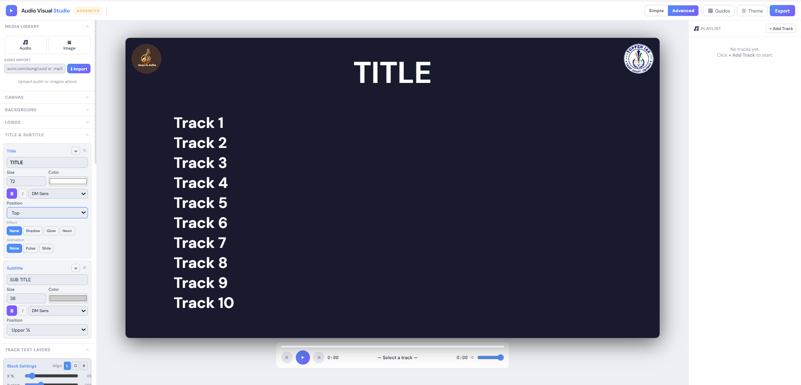
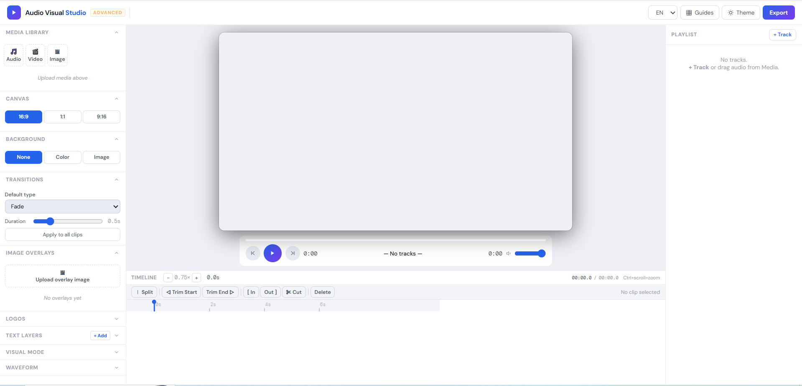
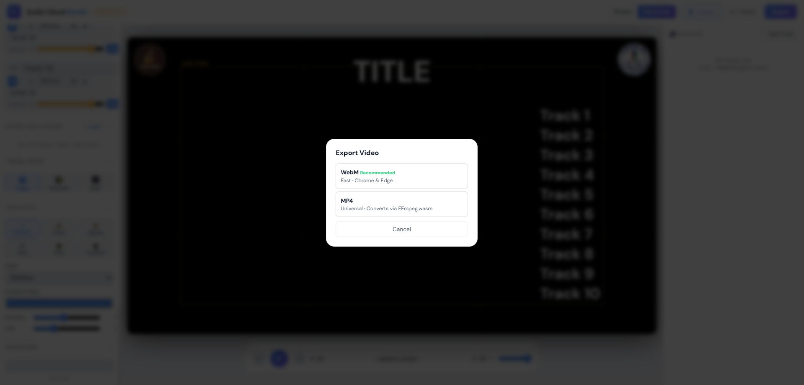
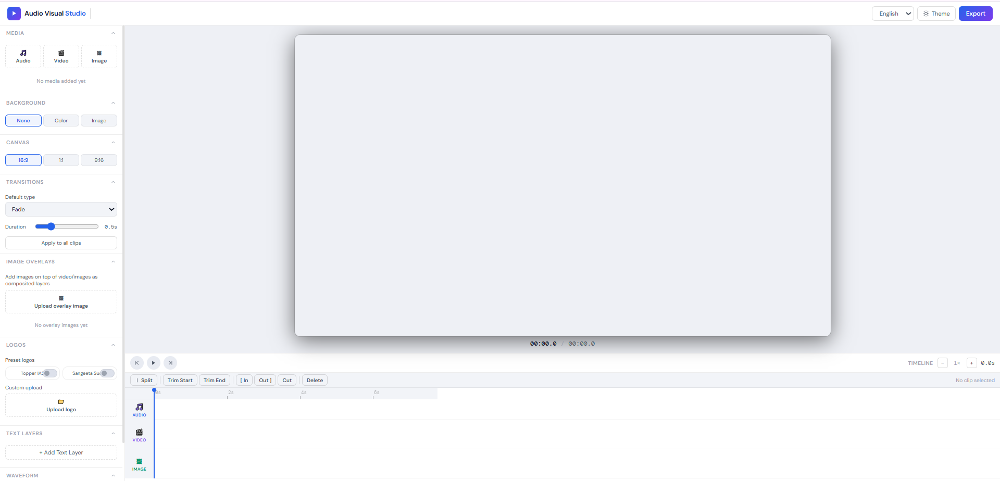

<p align="center">
  
</p>

<h1 align="center">Audio Visual Studio</h1>

<p align="center">
Browser-based multimedia composition tool for creating audio-synchronized videos with playlists, timeline editing, branding, visual effects, and client-side export.
</p>

<p align="center">
  
  
  
  
  
  
  
  
  
</p>

Create multimedia compositions entirely in your browser using local audio, images, videos, text overlays, branding, playlists, and visual effects—without installing desktop software or uploading your media to a server.

**100% Client-Side • Privacy First • Browser Based • No Backend**

🎬 Multimedia Composition &nbsp;·&nbsp; 🎵 Playlist Sync &nbsp;·&nbsp; ⚡ Local Processing &nbsp;·&nbsp; 🚀 Browser Export

---

## 🔗 Live Demos

The project evolved through multiple iterations during development. The demos below highlight key stages of that evolution.

| Demo | Description | Link |
|------|-------------|------|
| ⭐ Playlist / Unified Edition | Playlist sync combining Simple and Advanced workflows | [Open Demo](https://audiovisualstudioplaylist.netlify.app/) |
| Advanced Timeline Edition | Timeline-based editing interface | [Open Demo](https://audiovisualstudioadvanced.netlify.app/) |
| Simple Edition | Streamlined editing workflow | [Open Demo](https://audiovisualstudiosimple.netlify.app/) |
| Early Prototype | Initial browser-based prototype | [Open Demo](https://audiovisualstudiooldver.netlify.app/) |

---

> Audio Visual Studio is a browser-based multimedia composition tool developed during my Generative AI internship to support an internal educational content creation workflow. It combines playlist management, synchronized text highlighting, timeline editing, branding controls, audio-reactive visual effects, and client-side video export into a single application that runs entirely inside the browser.

---

# Preview

<p align="center">
  
</p>

---

# Highlights

- Browser-based multimedia composition tool
- Runs entirely on the client side with no backend required
- Processes media locally without uploading files to a server
- Simple and Advanced editing modes
- Playlist-based audio synchronization
- Timeline editing workflow
- Audio, image and video import
- SUNO audio import using browser-accessible URLs
- Configurable text overlays with audio-linked highlighting
- Branding and logo placement
- Audio-reactive particle effects
- Client-side WebM export with optional MP4 conversion via FFmpeg.wasm

---

## Project Facts

- 👨‍💻 Solo project
- 🏢 Developed during a Generative AI internship
- 🌐 Browser-based application
- 🔒 100% client-side processing
- 🚀 Deployed on Netlify

---

# Why Audio Visual Studio?

During my internship, multimedia content was frequently created for educational initiatives. Existing browser tools lacked playlist-based synchronization, flexible branding, and integrated editing workflows while desktop editors introduced unnecessary installation and setup overhead.

Audio Visual Studio was built to provide a browser-first workflow where media remains on the user's device while supporting synchronized multimedia composition from a single interface.

| Capability | Typical Browser Tools | Audio Visual Studio |
|------------|:--------------------:|:-------------------:|
| Browser based | ✅ | ✅ |
| Installation required | ❌ | ❌ |
| Local media processing | Varies | ✅ |
| Server uploads required | Often | ❌ |
| Playlist workflow | Rare | ✅ |
| Timeline editing | Limited | ✅ |
| Audio-linked text highlighting | Rare | ✅ |
| Branding controls | Limited | ✅ |
| Audio-reactive effects | Rare | ✅ |
| Client-side video export | Limited | ✅ |
| Privacy-first workflow | Varies | ✅ |

Unlike many online editing tools, Audio Visual Studio performs rendering, synchronization, and exporting locally in the browser, allowing projects to be created without sending media files to external servers.

---

# Core Features

## Multimedia Composition

- Import local audio, images and videos
- Import compatible SUNO-generated audio using browser-accessible URLs
- Playlist management
- Timeline editing
- Background image sequencing
- Video backgrounds
- Canvas aspect ratios (16:9, 1:1, 9:16)

---

## Text & Branding

- Multiple text layers
- Audio-linked highlighting
- Custom fonts
- Branding logos
- Position presets
- Layer visibility controls
- Dynamic highlight styling

---

## Visual Effects

- Audio-reactive particle effects
- Background transitions
- Multiple rendering modes
- Canvas-based rendering engine

---

## Export

- Real-time browser-based rendering
- Client-side WebM export
- Optional MP4 conversion using FFmpeg.wasm
- No server processing

---

## Privacy & Experience

- Browser-based application
- Local file processing
- No accounts
- No subscriptions
- No backend
- Responsive interface
- Supports local editing after the application has loaded*

\*Internet access is only required for opening the hosted application or importing media from online URLs.

---

# 📸 Screenshots

### 🏠 Playlist Workflow

Primary editing workspace featuring playlist management, synchronized text overlays, branding controls, and multimedia composition.



---

### 🎬 Advanced Timeline Editor

Timeline-based editing interface for more detailed multimedia composition.



---

### 📦 Client-Side Export

Export multimedia compositions directly from the browser.



---

### 🚀 Early Prototype

The initial browser-based prototype that established the core rendering workflow before later iterations.



---

# Built With

| Layer | Technology |
|--------|------------|
| Frontend | HTML5, CSS3 |
| Programming | Vanilla JavaScript (ES6) |
| Graphics & Rendering | HTML5 Canvas API |
| Audio Processing | Web Audio API |
| Browser APIs | MediaRecorder API, FileReader API |
| Video Conversion | FFmpeg.wasm |
| Deployment | Netlify |

---

# Architecture

```text
               Audio / Images / Videos
                        │
                        ▼
               Local Media Manager
                        │
                        ▼
             Playlist & Timeline Engine
                        │
          ┌─────────────┴─────────────┐
          ▼                           ▼
    Canvas Rendering           Audio Analysis
          │                           │
          └─────────────┬─────────────┘
                        ▼
             Multimedia Composition
                        │
              Text • Branding • Effects
                        │
                        ▼
             Live Browser Preview
                        │
               Client-Side Export
                  WebM / MP4
```

---

# Future Enhancements

- Save and load editing sessions
- Undo / Redo history
- Additional transition effects
- Keyboard shortcuts
- More export presets
- Timeline editing improvements

---

# Copyright & License

**Copyright © 2026 Harsham Irfan Bhat**

**All Rights Reserved.**

See the [LICENSE](LICENSE) file for copyright and usage terms.

---

# Author

**Harsham Irfan Bhat**

📧 harshamirfan@gmail.com

💼 https://www.linkedin.com/in/harsham-irfan-bhat/

---

### If you enjoyed exploring this project, consider giving the repository a ⭐.